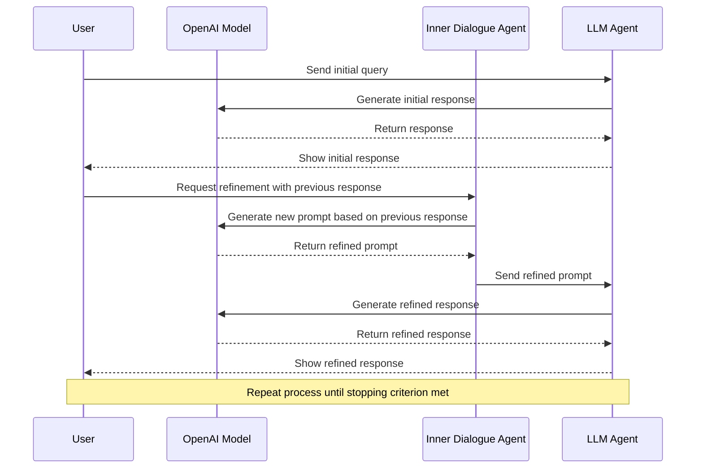

## Iteration of Thought (IoT) Framework for Generating Responses Using OpenAI's API for the Impatient: From Novice to Practitioner in Record Time

### 1. Introduction

#### Why IoT?

In today's fast-paced world, generating accurate and contextually relevant responses using AI is more critical than ever. Whether you're developing chatbots, virtual assistants, or any application that relies on natural language processing, understanding how to leverage frameworks like the Iteration of Thought (IoT) can significantly enhance your results.

#### What is IoT?

The Iteration of Thought framework is designed to facilitate iterative response generation through two primary methods: Autonomous Iteration of Thought (AIoT) and Guided Iteration of Thought (GIoT). These methods enable users to refine AI-generated responses through multiple iterations, ensuring that the final output is both accurate and comprehensive.

#### How does it work?

At its core, the IoT framework employs OpenAI's API to generate responses based on user queries. By implementing iterative processes, it allows for continuous improvement of these responses through feedback loops—essentially teaching the AI to think deeper with each iteration.

#### When to use it?

The IoT framework is particularly useful in scenarios where complex queries require nuanced understanding or where initial responses may lack depth or clarity. It’s ideal for applications in education, customer support, content generation, and more.

### 2. Getting Started

#### Setting Up Your Environment

To get started with the IoT framework, you’ll need to set up your environment correctly:

1. **Install Python:** Ensure you have Python installed on your machine (version 3.12 or higher).
2. **Set up OpenAI API:** Obtain your API key from OpenAI and set it as an environment variable.
3. **Install Dependencies:** Use Poetry or pip to install required packages:
   ```bash
   pip install openai loguru
   ```

#### Understanding the Code Structure

The provided code consists of several key components:

- **IterationOfThought Class:** This class manages the iteration process using specified models.
- **Methods:** 
  - `_call_openai`: Handles API calls.
  - `inner_dialogue_agent`: Generates new prompts based on previous responses.
  - `llm_agent`: Refines responses based on user queries.
  - `stopping_criterion`: Determines when to stop iterating.

### 3. Examples of IoT in Action

#### Simple Example: Basic Query Handling

Let’s start with a simple example using AIoT:

```python
sample_query = "What is the capital of France?"
final_response_aiot = iot.aiot(sample_query)
print(final_response_aiot)
```

In this example, we ask a straightforward question about France's capital. The AI will generate an initial response and refine it through iterations until it reaches a satisfactory answer.

#### Intermediate Example: Refining Responses

Now let’s look at an intermediate example using GIoT:

```python
sample_query = "Explain photosynthesis."
final_response_giot = iot.giot(sample_query, fixed_iterations=3)
print(final_response_giot)
```

Here, we are asking for an explanation of photosynthesis over three iterations, allowing us to obtain a more detailed understanding each time.

#### Advanced Example: Complex Query Iteration

For our advanced example, let’s tackle a more complex query:

```python
sample_query = "Describe the impact of climate change on marine biodiversity."
final_response_aiot = iot.aiot(sample_query)
print(final_response_aiot)
```

This query might require multiple iterations for deeper insights into various aspects related to climate change and marine life.

### 4. Interactive Elements

#### Quick Quiz: Test Your Knowledge

**Question:** What are the two main components of the IoT framework?

- A) AIoT and GIoT
- B) Machine Learning and Deep Learning
- C) Data Science and Data Engineering

*Pause and reflect before checking your answer!*

### 5. Pro Tips

- **Craft Effective Prompts:** The quality of your prompts significantly influences response quality. Be clear and specific.
- **Iterate Wisely:** Not all queries require multiple iterations; assess when it's necessary based on complexity.

### 6. Common Misconceptions

Many users believe that simply sending queries to AI will yield perfect results without needing refinement—this is a misconception! Iterative frameworks like IoT are essential for enhancing response accuracy and relevance.

### 7. Sequence Diagram: Understanding IoT Process

To visualize how the IoT framework operates, here’s a Mermaid sequence diagram illustrating the interaction between different components during response generation:



### 8. Conclusion

Congratulations! You’ve now gained foundational knowledge about the Iteration of Thought framework for generating responses using OpenAI's API.

#### Call-to-Action: Apply What You've Learned!

To put your new knowledge into practice within 24 hours:
1. Choose a topic you're passionate about.
2. Formulate a query related to that topic.
3. Implement either AIoT or GIoT using the provided code structure.
4. Share your refined response with peers or colleagues!

By taking these steps, you'll not only reinforce what you've learned but also begin applying it in real-world scenarios—empowering you as a practitioner in no time!

---

If you would like me to elaborate further on any specific section or have additional requests, please let me know!
