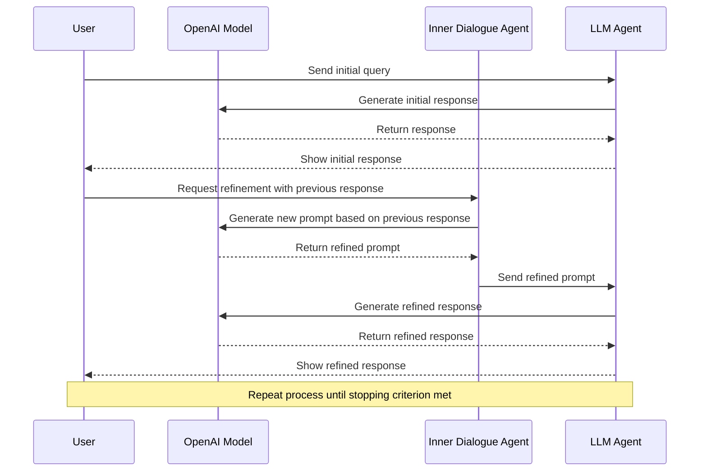

## Iteration of Thought (IoT) Framework

### 1. Introduction

#### Why IoT?

Generating accurate and contextually relevant responses using AI is more critical than ever. Whether you're developing chatbots, virtual assistants, or any application that relies on natural language processing, understanding how to leverage frameworks like the Iteration of Thought (IoT) can significantly enhance your results.

This implementation is based on the article: https://arxiv.org/pdf/2409.12618

> 💡 Iteration of Thought: Leveraging Inner Dialogue for Autonomous Large Language Model Reasoning

#### What is IoT?

The Iteration of Thought framework is designed to facilitate iterative response generation through two primary methods: Autonomous Iteration of Thought (AIoT) and Guided Iteration of Thought (GIoT). These methods enable users to refine AI-generated responses through multiple iterations, ensuring that the final output is both accurate and comprehensive.

- **AIoT**: Adapts the response generation process, allowing for early termination based on response quality.
- **GIoT**: Follows a fixed number of iterations, ensuring consistent output regardless of response quality.

#### How does it work?

At its core, the IoT framework employs an LLM to generate responses based on user queries. By implementing iterative processes, it allows for continuous improvement of these responses through feedback loops—essentially teaching the AI to think deeper with each iteration.

#### When to use it?

The IoT framework is particularly useful in scenarios where complex queries require nuanced understanding or where initial responses may lack depth or clarity. It's ideal for applications in education, customer support, content generation, and more.

### 2. Getting Started

#### Setting Up Your Environment

To get started with the IoT framework, you'll need to set up your environment correctly:

1. **Install Python:** Ensure you have Python installed on your machine (version 3.11 or higher).
2. **Set up OpenAI API:** Obtain your API key from OpenAI and set it as an environment variable. (You can use another model for example ollama/gemma2:2b)
3. **Install Poetry:** If you haven't already, install Poetry by following the instructions on the [Poetry website](https://python-poetry.org/docs/#installation).
4. **Clone the Repository:** Clone the repository containing the IoT framework code:
   ```bash
   git clone https://github.com/raphaelmansuy/iteration_of_thought
   cd iteration_of_thought
   ```
5. **Install Dependencies:** Use Poetry to install required packages:
   ```bash
   poetry install
   ```

#### Running the Program

To run the program, you can use the following command within the Poetry environment:

1. **Activate the Poetry Shell:**
   ```bash
   poetry shell
   ```
2. **Run the Main Script:**
   ```bash
   python src/iot_agent/main.py --method AIoT --query "Your query here" --temperature 0.5
   ```

   You can specify the method (`AIoT` or `GIoT`), the query, and the sampling temperature for the LLM response.

#### Understanding the Code Structure

The provided code consists of several key components:

- **IterationOfThought Class:** This class manages the iteration process using specified models and includes methods for both AIoT and GIoT.
- **Methods:** 
  - `_call_llm`: Handles API calls to an LLLM service.
  - `inner_dialogue_agent`: Generates new prompts based on previous responses to refine the output.
  - `llm_agent`: Combines the user query with the generated prompt to produce a refined response.
  - `stopping_criterion`: Determines when to stop iterating based on the content of the response.
  - `aiot`: Implements the Autonomous Iteration of Thought process.
  - `giot`: Implements the Guided Iteration of Thought process.

### 3. Code Explanation

#### Main Components

1. **Imports and Configuration:**
   The code begins by importing necessary libraries and setting up configuration variables, including the OpenAI API key and model type.

   ```python
   import os
   import time
   import signal
   from typing import Optional
   from loguru import logger
   import click
   from rich.console import Console
   from rich.panel import Panel
   from rich.progress import Progress, SpinnerColumn, TextColumn
   from rich.prompt import Prompt
   from rich.table import Table
   from rich.markdown import Markdown
   from litellm import completion
   import requests  # Added for handling URL requests
   ```

2. **API Key Handling:**
   The API key is retrieved from the environment variables. If it is not set, an error is raised.

   ```python
   API_KEY = os.getenv("OPENAI_API_KEY")
   if not API_KEY:
       raise ValueError("OpenAI API key must be set as an environment variable.")
   ```

3. **IterationOfThought Class:**
   This class encapsulates the logic for both AIoT and GIoT methods. It initializes with parameters such as the model type, maximum iterations, timeout settings, and temperature.

   ```python
   class IterationOfThought:
       def __init__(self, model: str = MODEL, max_iterations: int = 5, timeout: int = 30, temperature: float = 0.5):
           self.model = model
           self.max_iterations = max_iterations
           self.timeout = timeout
           self.temperature = temperature
   ```

4. **API Call Method:**
   The `_call_llm` method handles the interaction with the OpenAI API, including error handling for rate limits.

   ```python
   def _call_llm(self, prompt: str, temperature: Optional[float] = None, max_retries: int = 3) -> str:
       for _ in range(max_retries):
           try:
               with console.status(f"[bold green]Calling {self.model} API...", spinner="dots"):
                   response = completion(
                       model=self.model,
                       temperature=temperature or self.temperature,
                       messages=[{"role": "user", "content": prompt}],
                   )
               return response["choices"][0]["message"]["content"].strip()
           except Exception as e:
               console.print(f"[red]Error: {e}")
               return ""
       console.print("[red]Failed to get a response from OpenAI API after max retries")
       return ""
   ```

5. **Inner Dialogue Agent:**
   This method generates a new prompt based on the previous response, encouraging deeper reasoning.

   ```python
   def inner_dialogue_agent(self, query: str, previous_response: str) -> str:
       prompt = (
           f"Given the original query: '{query}' and the previous response: '{previous_response}', "
           "generate an instructive and context-specific prompt to refine and improve the answer."
       )
       return self._call_llm(prompt)
   ```

6. **AIoT and GIoT Methods:**
   The `aiot` method implements the autonomous iteration process, while the `giot` method follows a fixed number of iterations.

   ```python
   def aiot(self, query: str) -> str:
       # Implementation of AIoT
   ```

   ```python
   def giot(self, query: str, fixed_iterations: int) -> str:
       # Implementation of GIoT
   ```

7. **User Interaction:**
   The `get_user_query` function prompts the user for input, allowing for a sample query or a custom one.

   ```python
   def get_user_query() -> str:
       user_input = Prompt.ask("Query", default=sample_query)
       return user_input
   ```

8. **Main Function:**
   The `main` function orchestrates the execution of the program, handling user input and displaying results.

   ```python
   @click.command()
   @click.option("--method", type=click.Choice(["AIoT", "GIoT", "both"]), default="AIoT", help="Choose the method to run")
   def main(method: str) -> None:
       # Main execution logic
   ```

### 4. Examples of IoT in Action

#### Simple Example: Basic Query Handling

Let's start with a simple example using AIoT:

```python
sample_query = "What is the capital of France?"
final_response_aiot = iot.aiot(sample_query)
print(final_response_aiot)
```

In this example, we ask a straightforward question about France's capital. The AI will generate an initial response and refine it through iterations until it reaches a satisfactory answer.

#### Intermediate Example: Refining Responses

Now let's look at an intermediate example using GIoT:

```python
sample_query = "Explain photosynthesis."
final_response_giot = iot.giot(sample_query, fixed_iterations=3)
print(final_response_giot)
```

Here, we are asking for an explanation of photosynthesis over three iterations, allowing us to obtain a more detailed understanding each time.

#### Advanced Example: Complex Query Iteration

For our advanced example, let's tackle a more complex query:

```python
sample_query = "Describe the impact of climate change on marine biodiversity."
final_response_aiot = iot.aiot(sample_query)
print(final_response_aiot)
```

This query might require multiple iterations for deeper insights into various aspects related to climate change and marine life.

### 5. Interactive Elements

#### Quick Quiz: Test Your Knowledge 🧠✨

**Question:** What are the two main components of the IoT framework? 🤔

- A) AIoT and GIoT 🌐🔄
- B) Machine Learning and Deep Learning 📊🧠
- C) Data Science and Data Engineering 📈🔧

*Pause and reflect before checking your answer!*

### 6. Pro Tips

- **Craft Effective Prompts:** The quality of your prompts significantly influences response quality. Be clear and specific.
- **Iterate Wisely:** Not all queries require multiple iterations; assess when it's necessary based on complexity.

### 7. Common Misconceptions

Many users believe that simply sending queries to AI will yield perfect results without needing refinement—this is a misconception! Iterative frameworks like IoT are essential for enhancing response accuracy and relevance.

### 8. Sequence Diagram: Understanding IoT Process

To visualize how the IoT framework operates, here's a Mermaid sequence diagram illustrating the interaction between different components during response generation:



### 9. Conclusion

#### Call-to-Action: Apply What You've Learned!

To put your new knowledge into practice within 24 hours:
1. Choose a topic you're passionate about.
2. Formulate a query related to that topic.
3. Implement either AIoT or GIoT using the provided code structure.
4. Share your refined response with peers or colleagues!

By taking these steps, you'll not only reinforce what you've learned but also begin applying it in real-world scenarios—empowering you as a practitioner in no time!

